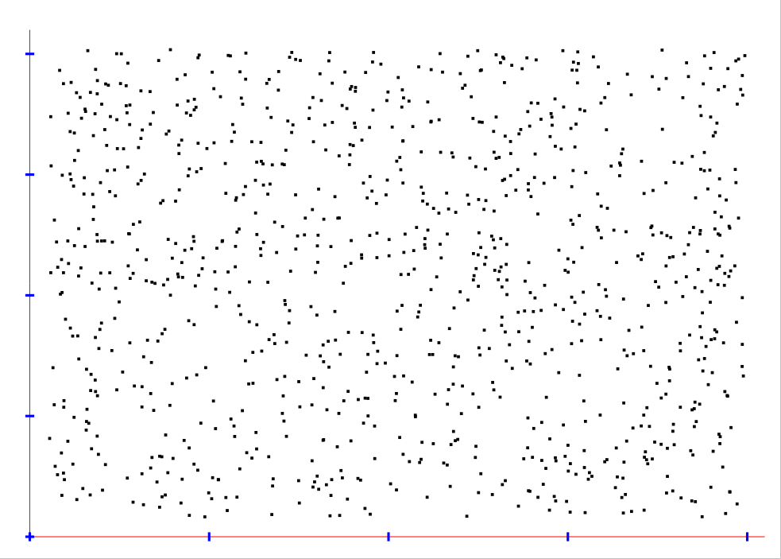

[back to main documentation](../Documentation.md)
# Dispersion Chart

Показывает кореляцию между двумя величинами, представляя зависимость в виде точек на плоскости, которые соответствуют
измерениям, у которых первая координата равна первой величине, а вторая координата - второй.

Формат данных:
* Каждая строка содержит два вещественных числа - значения первой и второй величины соответственно. Количество строк
неограничено

Пример коректных входных данных:
> 0.50744 0.912316  
> -1 10  
> 239239 0.57402146  
> 14.00 0.9116634  
> 0.43445516 0.9193961  

Пример диаграмы:  

[back to main documentation](../Documentation.md)