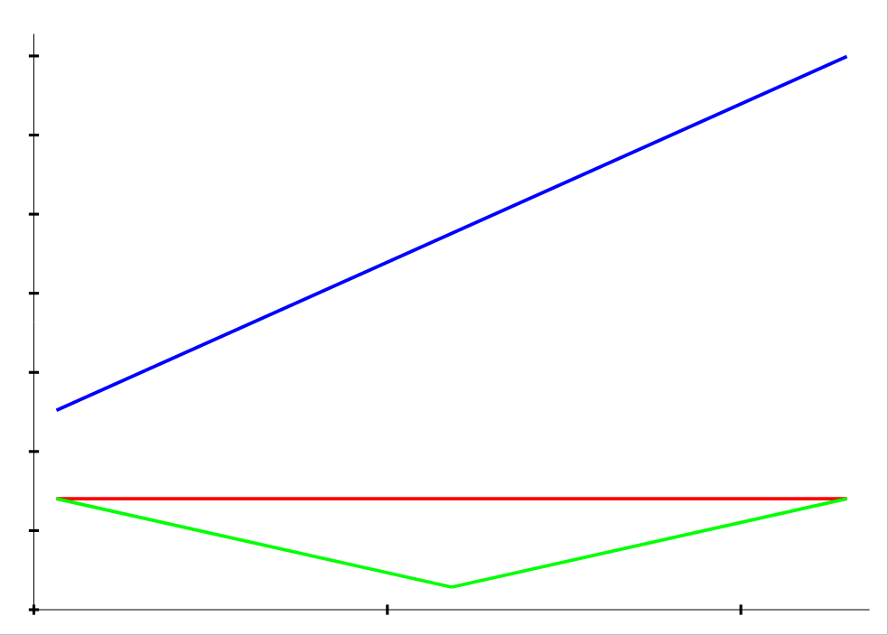

[back to main documentation](../Documentation.md)
# Graph Chart

Визуализирует изменения зависимых велечин (y) относительно одной независимой величины (x) в виде множества графиков.

Формат данных:
* Каждый график описывается двумя строками с одним и тем же количеством вещественных чисел. В первой строке записаны
значения независимой величины, а во второй -- значения зависимой, соответствующие значениям из первой строке.
* Количество чисел в описании разных графиков может быть разное.

Пример коректных входных данных:
> 1 2 3  
> 1 1 1  
> 1 2 3  
> 1 0 1  
> 1 3  
> 2 6  

Пример диаграмы:  

[back to main documentation](../Documentation.md)