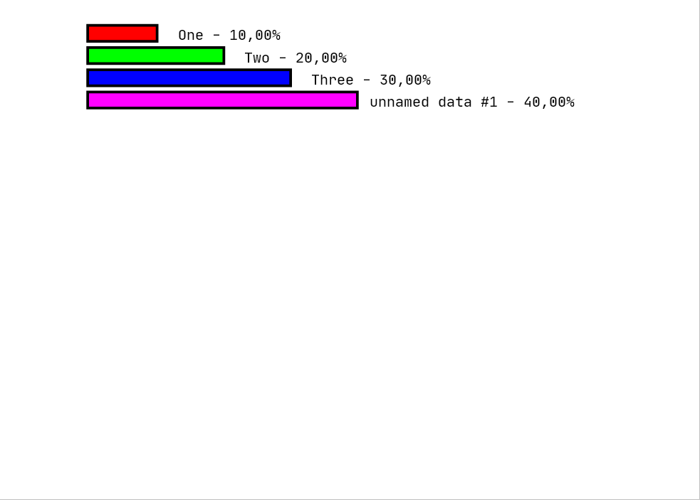

[back to main documentation](../Documentation.md)
# Histogram

Показывает соотношение между количественными данными, представляя их горизонтальными столбцами с соотношением длин,
равными соотношениям данных. Также процентное отношение каждой велечины к сумме всех величин указывается с точностью
до 0,01%.

Формат данных:
* Каждое значение вводится на отдельной строке, сначала записывается выщественное число - значение, потом строка
  -- название. Количество строк неограничено
* Можно опустить названия для значений. В таком случае все данные без названия будут подписаны
  дефолтными именами (unnamed data #1, unnamed data #2, ... и т.д.)

Пример коректных входных данных:
> 1 One  
> 2 Two  
> 3 Three  
> 4

Пример диаграмы:  

[back to main documentation](../Documentation.md)