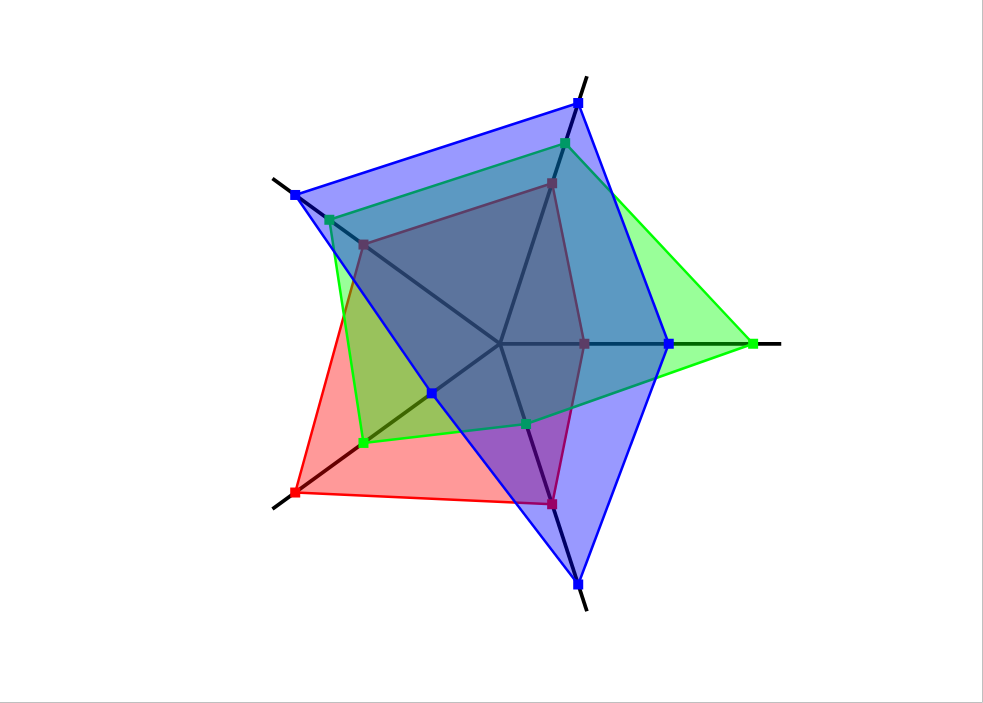

[back to main documentation](../Documentation.md)
# Petal Chart

Визуализирует сравнение объектов, у которых много (больше 2) параметров, каждый из которых задаётся веществнным числом.
Диаграма представлят собой n отрезков, выходящих из одной точки. На каждом отрезке откладываются параметры объектов
и точки соединяются в многоугольник.

Формат данных:
* Каждая строка содержит несколько (больше 2) вещественных чисел. Каждая строка - это описание параметров
одного объекта
* Количество чисел в каждой строке должно быть одинаковым

Пример коректных входных данных:
> 1 2 3 4 4  
> 3 1 2 5 5  
> 2 3 1 6 6  

Пример диаграмы:  

[back to main documentation](../Documentation.md)