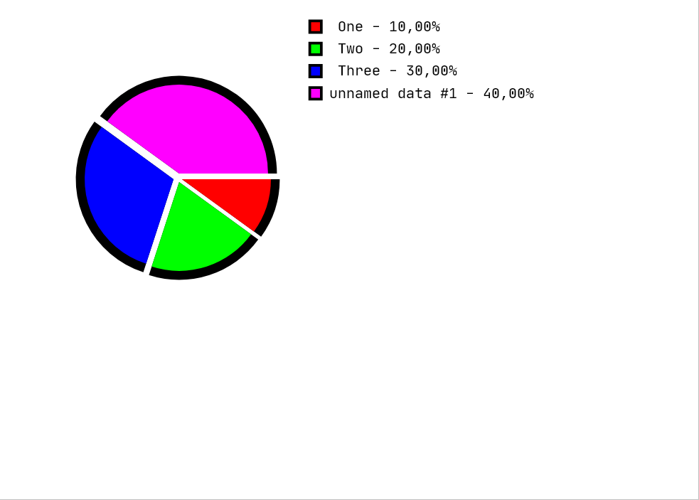

[back to main documentation](../Documentation.md)
# Pie Chart

Показывает соотношение между количественными данными, представляя их секторами круга с соотношениями площадей,
равными соотношениям данных. Также процентное отношение каждой велечины к сумме всех величин указывается с точностью
до 0,01% справа от диаграмы.  

Формат данных:  
* Каждое значение вводится на отдельной строке, сначала записывается выщественное число - значение, потом строка
 -- название. Количество строк неограничено  
* Можно опустить названия для значений. В таком случае все данные без названия будут подписаны
дефолтными именами (unnamed data #1, unnamed data #2, ... и т.д.)

Пример коректных входных данных:  
> 1 One  
> 2 Two  
> 3 Three  
> 4  

Пример диаграмы:  

[back to main documentation](../Documentation.md)